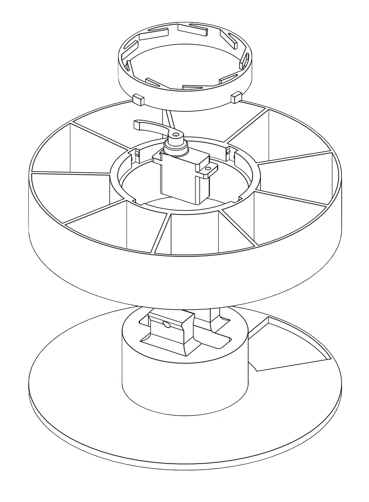

<!-- PROJECT LOGO -->
 

<h1 align="center">TreatTurbine</h1>

 

    Autonomous UAV-mounted treat dispensing system developed in partnership with Alveus Sanctuary.
  

  

  
<h2 align="left">Table of Contents</h2>

<h2 align="left">Overview</h2>
  

    This system is designed to deliver small treats via an unmanned aerial vehicle (UAV). Its advantages include the capability to reach remote areas, perform pre-programmed jobs, and keeping people far away from the animals it serves. 
  

  

  
<h2 align="left">Features</h2>
  

    - Versatile, designed to work with different payloads and different drone platforms
    - Designed to be cheap, easy to manufacture, and easy to use
    - 
  

  

  
<h2 align="left">Hardware / Requirements</h2>
  

    What someone needs before they can use this.
  

  

  
<h2 align="left">Getting Started</h2>
  

    Step by step — how to get from zero to working.
  

  

<h2 align="left">Usage</h2>
  

    How to actually operate it once set up.
    Screenshots or diagrams help here.
  

  

<h2 align="left">Documentation</h2>
  

    In order to make the Treat Turbine more accessible, considerable effort has gone into documenting and recording the steps required to reproduce it. Instructions, usage notes, 3D print files, and software, can be found in this Github repo. A complete version of the Onshape CAD files ready for your modifications can be found here: https://cad.onshape.com/documents/a14a263d4646380f37314a8a/w/1a27b2a84b8e4b9b2ac841da/e/305afa125aeae7e1aa674fe5?renderMode=0&uiState=69d34d6fe492bf831c8f658f
  

  

<h2 align="left">Contributing</h2>
  

    Brief note + link to CONTRIBUTING.md
  

  

<h2 align="left">License</h2>
  

    Apache 2.0 License — \[LICENSE.md\](https://github.com/skbecken/TreatTurbine/blob/main/LICENSE)
  

  

<h2 align="left">Contact</h2>
  

    Sophia Becken - skbecken@bu.edu
  
    Aidan Donovan - 
  
    Harrison Grant - hgrant@bu.edu
  
    Sofia Kamal - 
  
    Jason Sayah - jsnsayah@bu.edu
  
    Project Link: https://github.com/skbecken/TreatTurbine/tree/main
  

  

<h2 align="left">Acknowledgements</h2>
  

    Alveus Sanctuary, Boston University, RASTIC, Team 223
  

  

